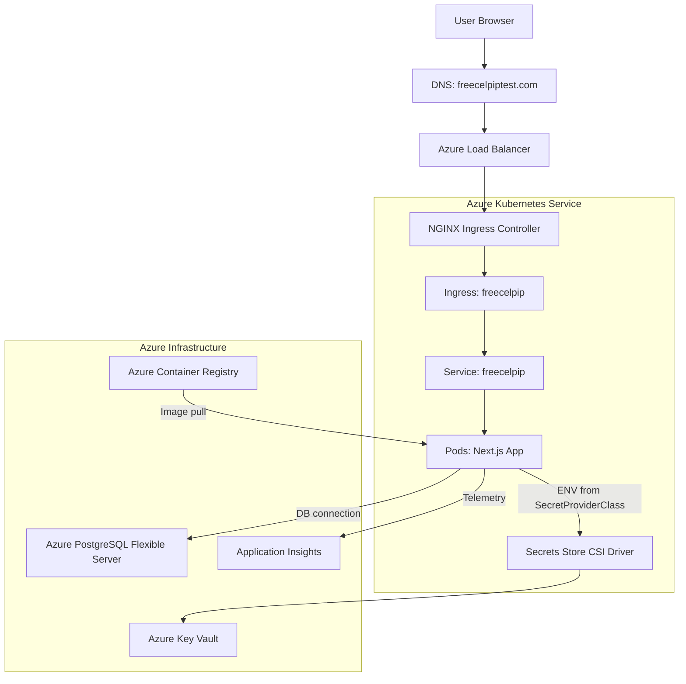

# FreeCELPIPTest Platform

FreeCELPIPTest is a production-grade, real-world learning platform for CELPIP candidates. It blends a polished learning experience with a serious cloud architecture: Next.js 15 on AKS, Key Vault–backed secrets, PostgreSQL, and full CI/CD with azd.

This repository is also my Azure DevOps portfolio piece. It is intentionally end-to-end: frontend, backend, infra, security, and deployment automation in one place.

## Why This Project Matters

- Real users, real needs: practice tests, guided prep, and a learning-first UX
- Cloud-native by design: autoscaling, secrets, and zero-trust patterns
- Production workflow: CI/CD, observability, and reliable releases

## Highlights

- Next.js 15 App Router with TypeScript
- AKS deployment via azd and Helm
- Azure Key Vault + CSI driver for secrets
- PostgreSQL Flexible Server with private networking
- Application Insights for telemetry
- NGINX Ingress + cert-manager for HTTPS
- Mobile-first, accessible UI

## Architecture (Short Explanation)

Users reach the platform through DNS and an Azure Load Balancer. Traffic lands on NGINX Ingress in AKS, routes through Kubernetes Services, and hits the Next.js pods. Secrets are pulled securely from Azure Key Vault using the CSI driver, while the app talks to PostgreSQL over private networking. Telemetry flows into Application Insights, and container images come from ACR.



## Local Development

### Prerequisites

- Node.js 18+
- PostgreSQL database
- Google OAuth credentials

### Setup

```bash
npm install
cp .env.example .env
```

Populate `.env` with your values, then:

```bash
npx prisma generate
npx prisma db push
npm run dev
```

## Deploy to Azure (azd)

This repo is wired for azd. The full production workflow is documented here:

- [azure/README.md](azure/README.md)
  
Fast path:

```bash
azd auth login
azd env new dev
azd up
```

## Project Structure

```
FreeCelpipTest/
├── app/                    # Next.js App Router
├── components/             # UI + sections + layout
├── azure/                  # Azure infra, Helm, and deployment scripts
├── prisma/                 # Prisma schema
└── public/                 # Static assets
```

## Showcase Notes

- This project emphasizes reliability: pod disruption budgets, rolling updates, and HPA.
- Security is a first-class citizen: Key Vault, managed identity, private DB networking.
- The UI is practical and human-first, built for real learners.

## Disclaimer

This website is not affiliated with or endorsed by CELPIP. It is an independent study resource built for learners.

## Support

For questions or issues, please contact us through the contact page or open an issue on GitHub.

